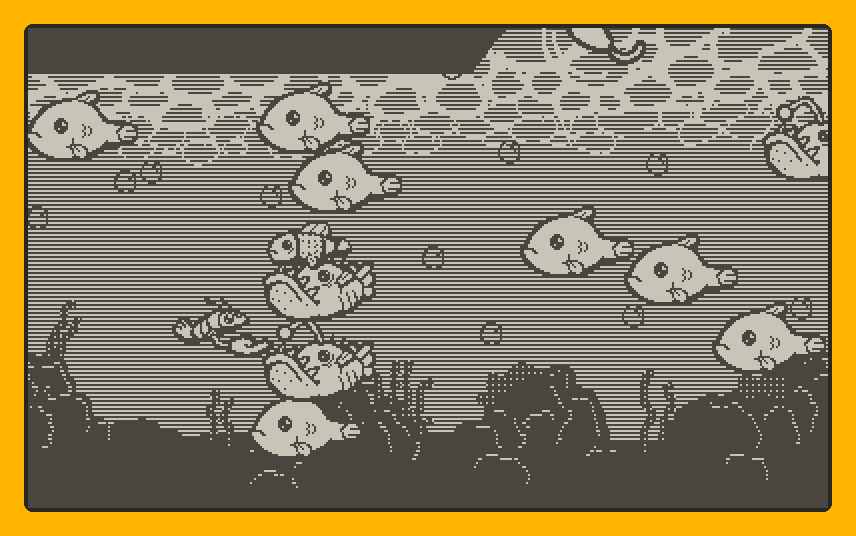
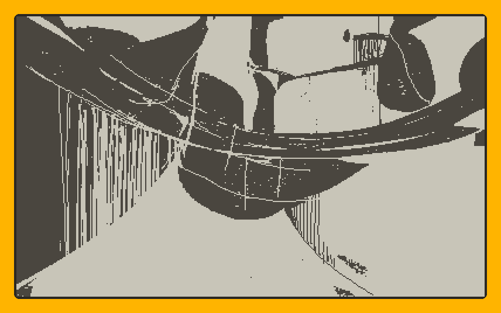
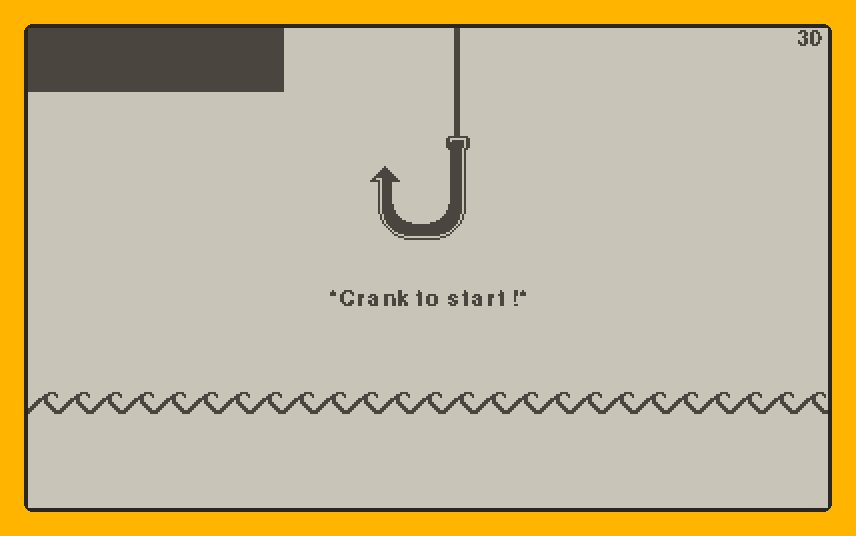
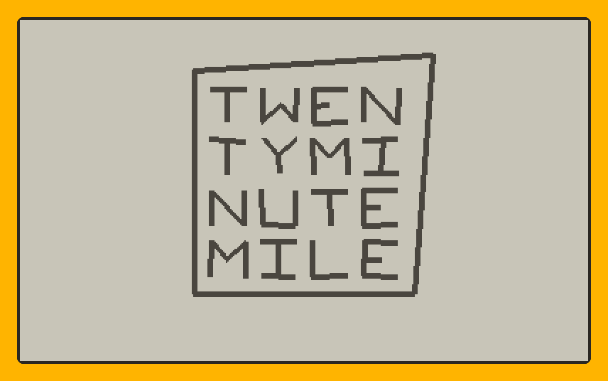
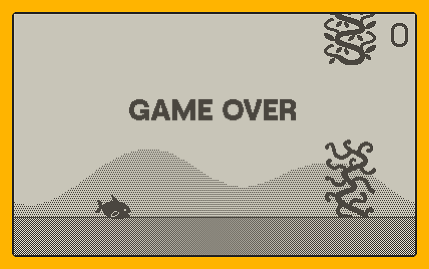
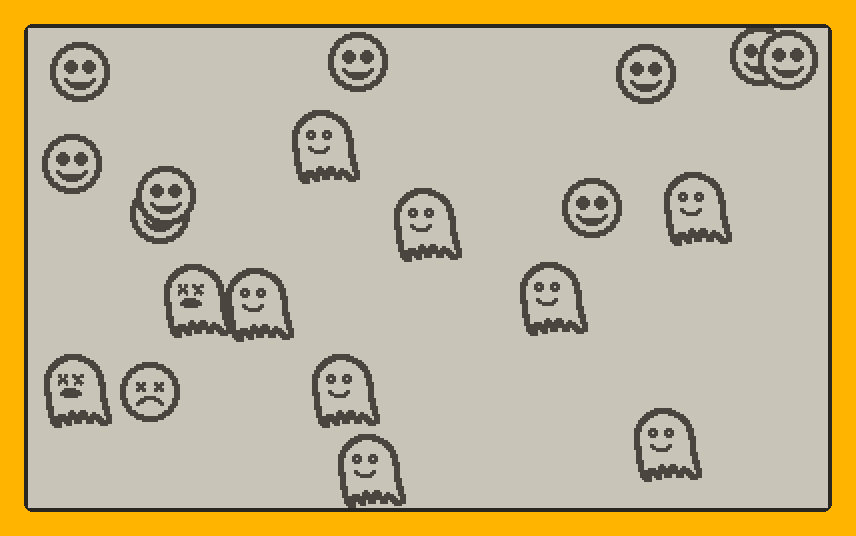

# Playdate-Pi — Playdate emulator in Python

A **runtime/emulator for the Playdate** written in Python that runs **real
compiled games `.pdx`** (Lua 5.4 / 32-bit bytecode), reimplementing the
`playdate.*` API on top of Lua via **lupa**, with rendering and audio via
**pygame-ce**.

It is not a CPU-level emulator (no QEMU): it is a **runtime** that loads the
`.pdx`, decodes the compiled formats (`.pdz`, `.pdi`, `.pdt`, `.pft`, `.pda`)
and executes the Lua chunks, translating the Playdate SDK API to Python. It
runs the same on your Mac and on a Raspberry Pi Zero 2 W.

> It works with **homebrew / itch.io unencrypted games** and SDK examples.
> Encrypted Catalog games (`bit 0x40000000`) are not executed.

## Quick start (no Playdate SDK, no console needed)

You do **not** need the Playdate SDK, a Playdate console, or any game source
code. Just install the Python requirements and run a compiled `.pdx`:

```bash
# 1. Install the requirements (Python 3.10+)
python -m venv .venv && source .venv/bin/activate
pip install -r requirements.txt

# 2. Build the Lua 5.4 / 32-bit bridge (one time; see note below)
sh tools/build_lua32.sh

# 3. Run a compiled game
python playdate_pi.py "games/<game>.pdx" --scale 3
```

That's it. Drop any unencrypted `.pdx` (from itch.io, homebrew, or the SDK
examples) into `games/` and run it. The emulator decodes the compiled formats
and reimplements the `playdate.*` API itself — the SDK is only needed if you
want to *compile* your own games, not to run them.

> **Why step 2?** Playdate compiles `.pdz` for a 32-bit Lua VM. The standard
> `pip install lupa` cannot load that bytecode, so the repo vendors the lupa
> source (`vendor/lupa/`) and `tools/build_lua32.sh` builds it against Lua 5.4
> with `LUA_32BITS`. It is a one-time build (macOS or Linux, including the Pi).

## Tested games

From **itch.io** (homebrew):

| Game | Screenshot | Status |
|------|------------|--------|
| **Shrimp Boom 004** |  |  4-direction movement, shooting, HUD, sound (bubbles/pop/death) |
| **Playdate Broken Screen** |  |  `.pdi` images decoded and drawn |
| **Fishing Simulator** |  |  Menu, scene, sound (catch/select/confirm) |
| **Smolitaire 1.0.1** |  |  Menu, gameplay, visible cursor (hand) |

From the **Playdate SDK** (compiled with `pdc`):

| Game | Screenshot | Status |
|------|------------|--------|
| **Flippy Fish** |  |  Animated fish, collisions, score, floor, seaweed |
| **Sprite Collision Masks** |  |  Group collision masks, bounces, sprites stay inside the box |

The game files themselves live in `games/` (see `.gitignore` — they are not
committed to the repo). Download the `.pdx` from itch.io / the SDK and drop
them there.

## Requirements

- **Python 3.10+** (tested on 3.14)
- **pygame-ce** `>=2.5` (the classic `pygame` won't do)
- **lupa** `>=2.0` **linked against Lua 5.4 with `LUA_32BITS`** — a critical
  requirement (Playdate compiles for a 32-bit Lua VM). See
  `docs/ARCHITECTURE.md`.

```bash
python -m venv .venv && source .venv/bin/activate
pip install -r requirements.txt
```

> **lupa + LUA_32BITS**: Playdate compiles `.pdz` for 32-bit Lua (floats are
> `double`, but offsets are 32-bit). lupa must be compiled/linked with that
> variant, or compiled chunks won't load and crash. The vendored source is in
> `vendor/lupa/` and `tools/build_lua32.sh` builds it.

## How to run

```bash
python playdate_pi.py "games/<game>.pdx" [--scale 2] [--palette device|bw|yellow] [--frames N] [--verbose]
```

Examples:

```bash
python playdate_pi.py games/shrimpboom004.pdx --scale 3
python playdate_pi.py "games/Fishing Simulator.pdx" --palette device
python playdate_pi.py games/FlippyFish.pdx --frames 400   # headless (test)
python playdate_pi.py games/shrimpboom004.pdx --verbose     # log API/assets
```

### Controls (map to D-pad + 2 buttons + crank)

| Key | Action |
|-----|--------|
| Arrows / WASD | D-pad |
| X / SPACE | A button (right) |
| Z / SHIFT | B button (left) |
| Q / E | Crank (counter-clockwise / clockwise) |
| ESC | Quit |

## How it works (architecture map)

Four layers turn the compiled `.pdx` into pixels and audio. Each has its own
section in [`docs/ARCHITECTURE.md`](docs/ARCHITECTURE.md) with diagrams.

```text
┌─────────────────────────────────────────────────────────────┐
│ 1. GAME LOADING   — uncompress/parse the .pdx (.pdz, .pdi,  │  pd/pdx.py
│    .pft, .pda, pdxinfo) and resolve assets                  │
├─────────────────────────────────────────────────────────────┤
│ 2. INTERPRETATION — lupa executes the Lua 5.4 32-bit chunks │  pd/luavm.py
│    ; the game asks for the API via playdate.*               │
├─────────────────────────────────────────────────────────────┤
│ 3. PYTHON API     — the playdate.* table is built           │  pd/runtime.py
│    ({graphics, sound, sprite, display, button, geometry})   │
├─────────────────────────────────────────────────────────────┤
│ 4. WRAPPING       — Playdate objects = userdata, flat       │  pd/luaobj.py
│    tables, metamethods, callbacks, gotchas                   │
└─────────────────────────────────────────────────────────────┘
```

Short version of each part:

1. **Game loading** — `.pdx` is a folder with `main.pdz`, `.pdi/.pdt/.pft/.pda`
   and `pdxinfo`. `pdz` is a container with chunks that may be compressed
   (`FLAG_COMPRESSED=0x80`) or encrypted (`FLAG_ENCRYPTED=0x40000000`, not
   supported). Assets are resolved **ignoring the extension**.
2. **Interpretation** — a lupa `LuaRuntime` plus `patch_lundump` loads 32-bit
   bytecode. `playdate.update()` runs in a coroutine (like the console).
3. **APIs** — the pattern: implement the method in Python and register it in
   `Runtime._build_api()`. Full guide and tooling in
   `docs/IMPLEMENTING_APIS.md` (including `tools/api_coverage.py` and
   `tools/headless_test.py`, which run your game and list the missing API).
4. **Wrapping** — Playdate objects are exposed as **userdata** (not tables)
   because games check `type(v)=="userdata"`. Tables are **flat** (Python
   functions on the leaves, never nested objects). Real Lua metamethods for
   operators (`polygon * transform`, `imagetable[i]`, `sprite:update()`
   defaults). lupa gotchas documented in `ARCHITECTURE.md`.

## Project structure

```text
playdate_pi/
├── playdate_pi.py          # entry point (CLI)
├── requirements.txt
├── README.md
├── docs/
│   ├── ARCHITECTURE.md     # per-component diagrams + wrapping + common bugs
│   ├── IMPLEMENTING_APIS.md  # how to add APIs + tooling
│   ├── COMPILED_GAMES.md  # compiled .pdx (LUA_32BITS, opcodes, import)
│   └── PFT_FONTS.md      # .pft font decoding
├── assets/screenshots/     # screenshots of the tested games
├── games/                  # the .pdx games (gitignored)
├── tools/                  # debug / API-coverage utilities
├── vendor/lupa/            # vendored lupa source (for LUA_32BITS build)
├── pd/
│   ├── pdx.py              # .pdz container + format
│   ├── pdi.py pft.py pda.py  # decoders for .pdi/.pft/.pda
│   ├── luavm.py            # LuaRuntime (lupa, 32-bit)
│   ├── runtime.py          # playdate.* API + loop (update/draw)
│   ├── graphics.py         # rendering (400x240, 1-bit palettes)
│   ├── sprite.py           # sprite system + collisions/bounces
│   ├── sound.py            # audio (pygame.mixer) + ADSR synth
│   ├── geometry.py image.py input.py screen.py emulator.py
│   ├── luaobj.py filestore.py
│   └── lib/                # Lua bridges (playdate_ext.lua, etc.)
```

## Status and limitations

**Works**: loads unencrypted `pdz`; decodes `.pdi/.pdt/.pft/.pda`; API of
`graphics`, `sound`, `sprite`, `geometry`, `display`, `button`, `file`.
Group/mask collisions with `collisionResponse`. Audio `.pda` (PCM + IMA ADPCM)
and synth (noise/sawtooth/square/sine/triangle with ADSR and notes at absolute
engine time). Background/appearance handled by the sprite system with real
console semantics.

**Limitations**: no encryption (Catalog); `CoreLibs/assets/*` that are not in
the `.pdx` emit warnings; some `sound` effects/APIs (sequence, filters) are
permissive stubs. The lupa bridge writes Lua fields (it never reads fields
that could pass through metamethods because coroutines).

## Contribute / move forward together

It is designed so other developers can extend it. To add an API or fix
fidelity: read `docs/ARCHITECTURE.md` and `docs/IMPLEMENTING_APIS.md`, follow
the patterns (Python method + registration in `_build_api()`, userdata, flat
tables, callbacks) and record the lesson learned. The games in the list are
good regression cases (the `tools/headless_test.py` runner steps every game
and reports the first error).

## Key discoveries (summary)

1. **lupa does not map Python `__mul__` to Lua metamethods**: use
   `debug.setmetatable` with a **Lua** function (not Python) as `__index`.
2. **Playdate objects must be userdata**, not tables: games check
   `type(v)=="userdata"`, and if it is `"table"` they take the wrong branch.
3. **`sprite.update()` / background**: sprites are only drawn if the GAME
   calls `sprite.update()` (console semantics); foreground = color or
   `background_cb`.
4. **Color**: `kColorBlack=0` (ink), `kColorWhite=1` (paper); `setColor` must
   interpret literals `0x000000`/`0xffffff`, not only booleans.
5. **Audio**: `synth:playNote(freq, vol, length, when)` uses `when` **absolute**
   (seconds since the audio engine started, not relative); default waveform =
   **noise**. `.pda` includes IMA ADPCM.
6. **Cursor/hand**: 1-bit images filled with paper (`bit=1`) are invisible on
   a light background; draw in ink when the sprite is predominantly paper.

Each is detailed (cause + fix) in `docs/ARCHITECTURE.md`.

## License

*(pick whichever you prefer — suggestion: MIT)*

---

Built with the [Playdate SDK](https://play.date/dev/), [lupa](https://github.com/scoder/lupa)
and [pygame-ce](https://pyga.me/).
